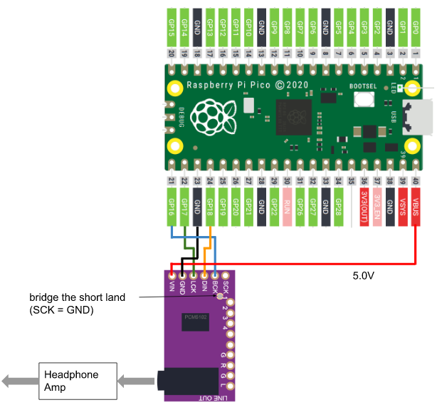

# Raspberry Pi Pico sine_wave with 32bit I2S DAC

## Overview
This project is an example for Raspberry Pi Pico to support 32bit/Stereo I2S DAC.  
The sample project included in [pico-playground/audio/sine_wave](https://github.com/raspberrypi/pico-playground/tree/master/audio/sine_wave) supports only 16bit I2S DAC in mono to stereo copy mode.  
This project supports:
* 32bit Stereo I2S (PCM5102)
* jitter-less bit clock frequency for 44.1KHz sampling rate (44118Hz)

## Supported Board and Peripheral Devices
* Raspberry Pi Pico
* PCM5102 32bit I2S Audio DAC
* ES9023 24bit I2S Audio DAC (not tested yet)

## Pin Assignment
In addition to original connection

| Pico Pin # | GPIO | Function | Connection |
----|----|----|----
| 21 | GP16 | BCK | to PCM5102 BCK (13) / to ES9024 BCK (1) |
| 22 | GP17 | LRCK | to PCM5102 LRCK (15) / to ES9023 LRCK (2) |
| 23 | GND | GND | GND |
| 24 | GP18 | SDO | to PCM5102 DIN (14) / to ES9023 SDI (3) |
| 40 | VBUS | VCC | to VIN of DAC board (5V) |



### PCM5102 Board Setting
* tie PCM5102 SCK (12) to low (bridge short land)
* H1L (FLT) = L
* H2L (DEMP) = L
* H3L (XSMT) = H
* H4L (FMT) = L

## How to build
* See ["Getting started with Raspberry Pi Pico"](https://datasheets.raspberrypi.org/pico/getting-started-with-pico.pdf)
* Build is confirmed only in Developer Command Prompt for VS 2019 and Visual Studio Code on Windows enviroment
* Put "pico-sdk", "pico-examples", "pico-extras" and "pico-playground" on the same level with this project folder.
```
> git clone -b master https://github.com/raspberrypi/pico-sdk.git
> cd pico-sdk
> git submodule update -i
> cd ..
> git clone -b master https://github.com/raspberrypi/pico-examples.git
> 
> git clone https://github.com/raspberrypi/pico-extras.git
> cd pico-extras
> git submodule update -i
> cd ..
> git clone https://github.com/raspberrypi/pico-playground.git
> 
> git clone -b main https://github.com/elehobica/rasp_pi_pico_sine_wave_i2s_32bit.git
```
* Lanuch "Developer Command Prompt for VS 2019"
```
> cd rasp_pi_pico_sine_wave_i2s_32bit
> mkdir build
> cd build
> cmake -G "NMake Makefiles" ..
> nmake
```
* Put "sine_wave.uf2" on RPI-RP2 drive

## Macro Definitions in audio_i2s.c
### CORE1_PROCESS_I2S_CALLBACK
 If defined, i2s_callback_func is processed at Core 1 while main routine and DMA IRQ handler is processed at Core 0.
 It will be efficient when generating audio data needs computing power. It does not contribute to reduce bus load and even make slightly worse when Core 1 is activated.

## Application Example
* [RPi_Pico_WAV_Player](https://github.com/elehobica/RPi_Pico_WAV_Player)
